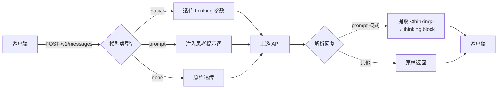
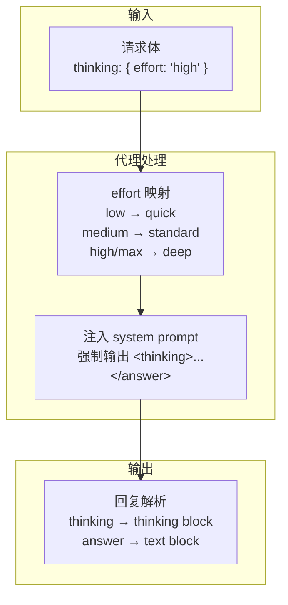

<p align="center">
  
  
  
</p>

# Thinking Proxy

> 为不支持原生 Extended Thinking 的 Claude API 代理，自动注入提示词模拟深度推理。



## 快速开始

```bash
git clone <repo-url> && cd thinking-proxy
cp .env.example .env          # 编辑填入上游 API 地址和密钥
docker compose up -d          # 启动 → http://localhost:19901
```

## 核心概念



| 模式 | 图标 | 行为 | 适用场景 |
|------|------|------|----------|
| `native` | 🔵 | 透传 `thinking` 参数 | 上游原生支持 thinking |
| `prompt` | 🟡 | 移除 `thinking`，注入提示词模拟 | **大多数中转 API（默认）** |
| `none` | ⚪ | 不做任何处理 | GPT / DeepSeek / Qwen 等 |

## API 端点

| 端点 | 说明 |
|------|------|
| `POST /v1/messages` | Anthropic Messages API |
| `POST /v1/chat/completions` | OpenAI Chat Completions API |
| `GET /v1/models` | 上游模型列表（含 `thinking_support` 标注） |
| `GET /health` | 健康检查 |

## effort 参数

完全兼容 Anthropic `thinking.effort` 语义：

| effort | 映射深度 | 推理强度 |
|--------|----------|----------|
| `low` | quick | 1-3 句简推理 |
| `medium` | standard | 完整五步推理 |
| `high` | deep | 多方案对比 + 详推导 |
| `max` | deep | 反事实分析 + 置信度 |

```bash
# 一行切换深度
curl http://localhost:19901/v1/messages \
  -H "Content-Type: application/json" \
  -d '{"model":"claude-sonnet-4-6","max_tokens":2000,"thinking":{"effort":"high"},"messages":[{"role":"user","content":"你的问题"}]}'
```

## 配置

### 环境变量

| 变量 | 说明 | 默认 |
|------|------|------|
| `UPSTREAM_BASE_URL` | 上游 API 地址 | —（必填） |
| `UPSTREAM_API_KEY` | 上游 API 密钥 | —（必填） |
| `PORT` | 监听端口 | `19901` |
| `DEFAULT_THINKING_DEPTH` | 默认思考深度 | `standard` |
| `PARSE_THINKING_RESPONSE` | 解析回复标签 | `true` |

### 模型能力矩阵

编辑 `config.json` 管理每个模型的 thinking 策略：

```jsonc
{
  "models": {
    "claude-sonnet-4-6":  { "thinking": "prompt" },
    "claude-opus-4-8":    { "thinking": "prompt" },
    "your-custom-model":  { "thinking": "native" },
    "gpt-5.5":            { "thinking": "none" }
  }
}
```

## 项目结构

```
src/
├── index.js      # 入口
├── config.js     # 环境变量 & 模型查询
├── proxy.js      # 转发核心（native/prompt/none 分支）
├── thinking.js   # 提示词生成 & effort 映射
├── parser.js     # 回复解析（提取/隐藏 thinking）
└── routes.js     # 路由定义
```

## License

MIT
